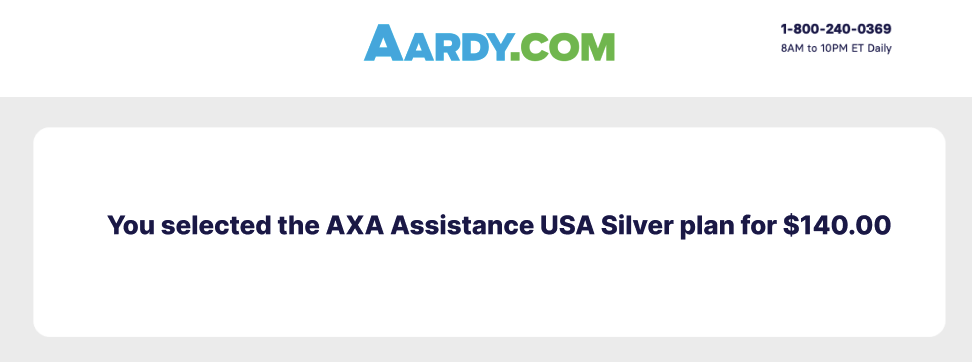

# Technical challenge

Thanks for your interest in working at Aardy.com, one of the leading travel insurance marketplaces in the USA. We have developed this task for you to work on in your own time so that we can see how you approach a problem and hopefully serve as a discussion point going forwards.

Try to spend less than two hours on the task and don't worry if you don't finish! We prefer to see quality over quantity.

Please implement the task however you like, but **please use React**.

## The task

Create a quote results layout screen using React, CSS and state management. Copy the design as close as visually possible (no specs given, on purpose).

You can find the plan data inside resources/data/plans.json and the provider images inside resources/images/providers.

Once you have the design and data populated as per screen 1. The only functionality you need to implement is the **Purchase** button. Once this is clicked, you need to display a new page that shows the selected product as per screen 2.

You will need to save the state of the selected policy, how you do this is up to you.

**Note:** you do NOT have to implement anything else.

**Screen 1**
---

**Screen 2**
---

## What do we look for?

We will assess the task based on the following criteria:

- How clean, modular and extensible the code is
- The techniques used to style the application
- Responsive techniques used
- Accessibility
- Approach to testing
- Anything that goes above and beyond